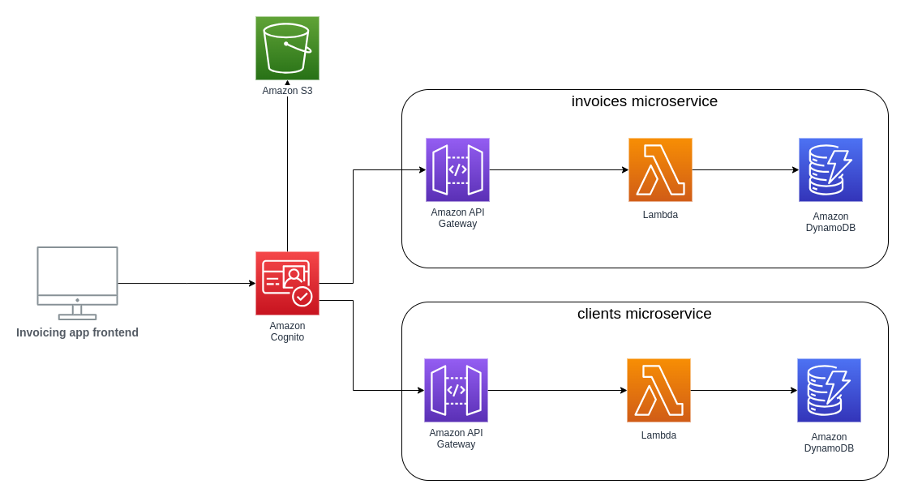

# Invoicing App AWS Microservices

This repository serves as the main documentation and overview for the Invoicing App AWS Microservices project. It provides links to the various repositories that make up the project, including the frontend application, AWS Cognito setup, client microservice, and invoices microservice.

## Repositories

1. **Frontend Invoicing App**
    - Description: This repository contains the code for the frontend of the invoicing application.
    - Repository Link: [Frontend Invoicing App](https://github.com/yakhousam/invoicing-app-frontend-netlify)

2. **Cognito Repository**
    - Description: This repository includes the setup for AWS Cognito, including the creation of user pools, S3 buckets, and other related resources.
    - Repository Link: [Cognito Repository](https://github.com/yakhousam/invoicing-app-backend-microservices-cognito-s3)

3. **Client Microservice**
    - Description: This repository contains the client microservice, which handles client-related operations.
    - Repository Link: [Client Microservice](https://github.com/yakhousam/invoicing-app-backend-microservices-clients)

4. **Invoices Microservice**
    - Description: This repository includes the invoices microservice, which manages invoice-related operations.
    - Repository Link: [Invoices Microservice](https://github.com/yakhousam/invoicing-app-backend-microservices-invoices)

## Overview

The Invoicing App AWS Microservices project is designed to provide a scalable and efficient invoicing solution using microservices architecture on AWS. Each repository is responsible for a specific part of the application, ensuring modularity and ease of maintenance.

## Getting Started

To get started with the project, clone the repositories listed above and follow the instructions in their respective README files.
